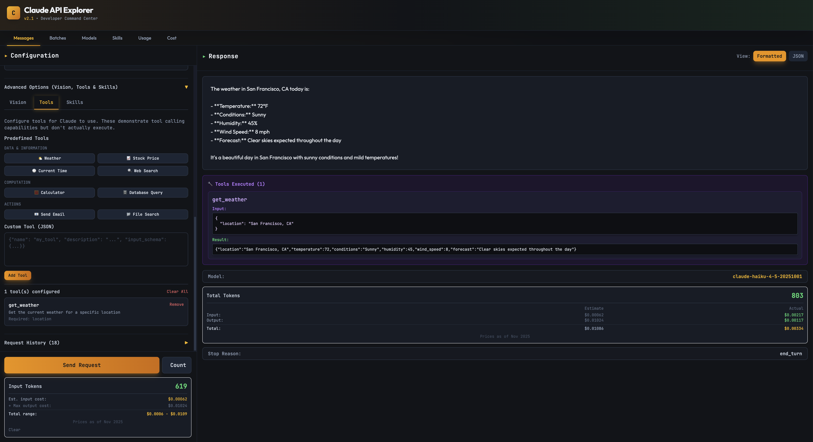

# Claude API Explorer

A visual, interactive web application for testing and exploring Anthropic's Claude API. Built with React, htm (no build step!), and Express.



## Features

### Core Functionality
- **Two-Panel Layout**: Configuration panel and Response display
- **Model Selection**: Choose from Claude Opus 4, Sonnet 4, Sonnet 4.5, Haiku, and legacy models
- **Request Configuration**: Adjust parameters like max_tokens, temperature, top_p, top_k
- **Multi-Message Support**: Build conversations with multiple user/assistant message pairs
- **Streaming Support**: Toggle between streaming and non-streaming responses (coming soon)

### Advanced Features
- **Vision Support**: Upload images via file picker or add by URL
- **Tool Use**: Configure predefined tools (calculator) or define custom tools via JSON
- **Request History**: Automatically saves last 50 requests with full request/response data
- **Export/Import**: Export history as JSON for backup or sharing
- **API Key Management**: Option to persist key or clear on browser close

### Response Display
- Toggle between formatted message view and raw JSON
- Token usage statistics (input/output/total)
- Model and stop reason metadata
- Error handling with inline display

## Tech Stack

- **React 18** with htm (Hyperscript Tagged Markup) - no build step required!
- **Tailwind CSS** via CDN
- **Express** proxy server for CORS handling
- **Vanilla JavaScript** ES6 modules
- **localStorage** for persistence

## Getting Started

### Prerequisites
- Node.js (any recent version)
- An Anthropic API key ([Get one here](https://console.anthropic.com/settings/keys))

### Installation

1. Clone or navigate to this directory

2. Install dependencies:
   ```bash
   npm install
   ```

3. Start both servers (use two terminals):

   **Terminal 1 - Start the proxy server:**
   ```bash
   npm start
   ```

   **Terminal 2 - Start the static file server:**
   ```bash
   python3 -m http.server 8000
   ```

4. Open your browser and navigate to:
   ```
   http://localhost:8000
   ```

### First Use

1. Enter your Anthropic API key in the Configuration panel
2. Choose whether to remember the key (localStorage) or clear it on browser close (sessionStorage)
3. Select a model and configure parameters
4. Enter your prompt in the Messages section
5. Click "Send Request"
6. View the response in the Response panel

## Project Structure

```
claude-api-explorer/
├── index.html                    # Entry point
├── server.js                     # Express proxy server (CORS handling)
├── package.json                  # Dependencies
├── README.md                     # This file
└── src/
    ├── main.js                   # React root renderer
    ├── FullApp.js                # Main application (all components in one file)
    ├── components/
    │   └── common/              # Reusable UI components
    │       ├── Button.js
    │       ├── Toggle.js
    │       └── Tabs.js
    ├── context/
    │   └── AppContext.js         # Global state management
    ├── config/
    │   ├── models.js             # Available models
    │   └── parameters.js         # Parameter definitions
    └── utils/
        ├── localStorage.js       # Storage helpers
        └── formatters.js         # Formatting utilities
```

## Architecture

### No Build Step Required
This project uses `htm` (Hyperscript Tagged Markup) which provides JSX-like syntax that works at runtime without any build step. React is loaded from CDN via import maps.

### Express Proxy Server
Since browsers can't directly call the Anthropic API due to CORS restrictions, we use a simple Express proxy server that:
- Forwards requests to `api.anthropic.com`
- Adds proper CORS headers
- Runs on `localhost:3001`

### State Management
Uses React Context API for global state, with useMemo optimization to prevent unnecessary re-renders.

### Data-Driven Configuration
Models and parameters are defined in JS modules, making it easy to add new models without touching component code.

## How It Works

1. **User configures request** in the left panel
2. **Click "Send Request"** button
3. **Request goes to Express proxy** at `localhost:3001`
4. **Proxy forwards to Anthropic API** at `api.anthropic.com`
5. **Response displays** in the right panel
6. **Request saved to history** in localStorage

## Security Notes

- API keys are stored in browser storage (localStorage or sessionStorage based on user preference)
- **Never commit API keys to version control**
- **Don't use production API keys** in development/testing
- Clear your API key when using shared or public computers
- The proxy server only forwards to Anthropic's API - no logging or storage

## Browser Compatibility

Requires a modern browser with support for:
- ES6 Modules
- Import Maps
- Fetch API
- localStorage

Tested on:
- Chrome 89+
- Firefox 108+
- Safari 16.4+
- Edge 89+

## Features Implemented

✅ API Key management with persist option
✅ Model selector (all Claude models)
✅ Parameter controls (temperature, top_p, top_k, max_tokens)
✅ System prompt
✅ Multi-message conversations
✅ Vision API (image uploads)
✅ Tool use configuration
✅ Request history (50 items, export/import)
✅ Response view toggle (Message/JSON)
✅ Token usage statistics
✅ Error handling
✅ localStorage persistence

## Limitations

- Streaming responses not yet implemented (shows loading state only)
- No image previews (only metadata shown)
- Limited to 50 history items
- No dark mode
- No keyboard shortcuts

## Future Enhancements

Potential improvements for the future:
- Implement streaming response display
- Add image previews in Vision tab
- Add dark mode
- Add keyboard shortcuts
- Add cost calculator
- Add response comparison view
- Migrate to TypeScript
- Add unit tests

## Troubleshooting

**"Failed to fetch" error:**
- Make sure both servers are running (proxy on :3001, static on :8000)
- Check that your API key is valid
- Check browser console for detailed errors

**Page doesn't load:**
- Clear browser cache and hard refresh (Cmd+Shift+R / Ctrl+Shift+R)
- Check browser console for errors
- Ensure you're using a modern browser with ES6 module support

**API errors:**
- Check your API key is correct
- Verify you have credits in your Anthropic account
- Check the error message in the Response panel for details

## Development

To modify the application:

1. All components are in `src/FullApp.js` for simplicity
2. Edit and save - just refresh the browser (no build step!)
3. Common components are in `src/components/common/`
4. State management is in `src/context/AppContext.js`
5. Utilities are in `src/utils/`

## Contributing

This is a personal project, but suggestions and improvements are welcome!

## License

MIT License - feel free to use this project for your own purposes.

## Links

- [Anthropic API Documentation](https://docs.anthropic.com)
- [Anthropic Console](https://console.anthropic.com)
- [Claude Models](https://docs.anthropic.com/claude/docs/models-overview)
- [htm Library](https://github.com/developit/htm)

## Acknowledgments

- Built with [React](https://react.dev)
- Styled with [Tailwind CSS](https://tailwindcss.com)
- Using [htm](https://github.com/developit/htm) for JSX-like syntax without build step
- Powered by [Anthropic's Claude API](https://www.anthropic.com)
- Inspired by [Square's API Explorer](https://developer.squareup.com/explorer/square)

---

**Note:** This is a development tool. For production use, consider adding authentication, rate limiting, and proper security measures.
