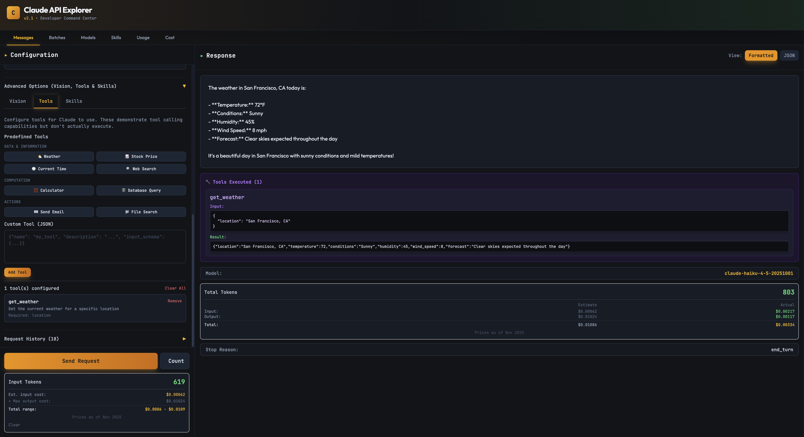

# Claude API Explorer

A visual, interactive web application for testing and exploring Anthropic's Claude API. Built with React, htm (no build step!), and Express.



## Features

### Core Functionality
- **Two-Panel Layout**: Configuration panel and Response display
- **Dynamic Model Selection**: Auto-fetches available models from `/v1/models`, merged with a static capability catalog
- **Request Configuration**: Adjust parameters like max_tokens, temperature, top_p, top_k
- **Multi-Message Support**: Build conversations with multiple user/assistant message pairs
- **Conversation Mode**: Chat-style interface for multi-turn conversations with automatic context preservation
- **Three API Tabs**: Messages, Skills (Beta), Files (Beta)
- **Skills API (Beta)**: List, create, get, and delete custom skills with folder drag & drop upload
- **Files API (Beta)**: Upload (drag & drop), list, get metadata, delete, download

### Streaming & Thinking
- **Streaming Responses**: Real-time SSE streaming with incremental text display and blinking cursor
- **Extended Thinking**: Manual budget control (1K-128K tokens) on models that support it
- **Adaptive Thinking**: Effort levels (low/medium/high/xhigh/max) — Fable 5, Opus 4.8/4.7/4.6, Sonnet 4.6
- **Structured Outputs**: JSON schema validation via `output_config.format`
- **Fast Mode**: `speed: "fast"` on Opus 4.8 (research preview)
- **Cache Diagnostics (Beta)**: send `diagnostics.previous_message_id` and see `cache_miss_reason`
- **Thinking Display**: Collapsible thinking blocks shown before response content

### Advanced Features
- **Vision Support**: Upload images via file picker or add by URL, with thumbnail previews
- **Server-Side Tools**: Toggle Anthropic-managed tools (Web Search, Web Fetch, Code Execution, Computer Use, Text Editor, Memory, Tool Search, Advisor)
- **Custom Tools**: Define a client tool schema as JSON — `tool_use` responses are rendered (the app does not execute tools client-side)
- **Request History**: Automatically saves last 50 requests with full request/response data, individual delete
- **Export**: Export history as JSON, Copy as cURL command
- **Raw Request Inspector**: See the exact headers/body/timing sent (API key redacted)
- **API Key Management**: Option to persist key or clear on browser close

### Response Display
- Toggle between formatted message view and raw JSON
- Token usage statistics (input/output/total, thinking tokens, cache hits, `usage.speed`)
- Model and stop reason metadata, including a refusal banner for `stop_reason: "refusal"`
- Error handling with inline display

## Tech Stack

- **React 19** with htm (Hyperscript Tagged Markup) - no build step required!
- **Tailwind CSS** via CDN
- **Express** proxy server for CORS handling
- **Vanilla JavaScript** ES6 modules
- **localStorage** for persistence
- **Jest 30** for unit testing

## Getting Started

### Prerequisites
- Node.js (any recent version)
- An Anthropic API key ([Get one here](https://console.anthropic.com/settings/keys))

### Installation

1. Clone or navigate to this directory

2. Install dependencies:
   ```bash
   npm install
   ```

3. Start the server:
   ```bash
   npm start
   ```

4. Open your browser and navigate to:
   ```
   http://localhost:3002
   ```

### First Use

1. Enter your Anthropic API key in the Configuration panel
2. Choose whether to remember the key (localStorage) or clear it on browser close (sessionStorage)
3. Select a model and configure parameters
4. Enter your prompt in the Messages section
5. Click "Send Request"
6. View the response in the Response panel

## Project Structure

```
claude-api-explorer/
├── index.html                    # Entry point
├── server.js                     # Express proxy server
├── jest.config.js                # Jest test configuration
├── package.json                  # Dependencies
├── README.md                     # This file
├── CLAUDE.md                     # AI development guide
├── .claude/                      # Claude Code configuration
│   ├── agents/                   # Custom review subagents
│   │   ├── api-docs-validator.md # Validates config against official Anthropic docs
│   │   ├── design-reviewer.md
│   │   ├── test-coverage-reviewer.md
│   │   └── code-reviewer.md
│   └── commands/                 # Slash commands
└── src/
    ├── main.js                   # React root renderer
    ├── FullApp.js                # Main application (~2200 lines)
    ├── components/
    │   ├── common/               # Reusable UI components (Button, Toggle, Tabs, ErrorBoundary)
    │   └── responses/            # Response panel components
    ├── context/
    │   └── AppContext.js         # Global state management
    ├── config/
    │   ├── models.js + .test.js     # Model catalog + capability matrix
    │   └── endpoints.js + .test.js  # Endpoint definitions
    └── utils/
        ├── localStorage.js
        └── formatters.js + .test.js
```

## Architecture

### No Build Step Required
This project uses `htm` (Hyperscript Tagged Markup) which provides JSX-like syntax that works at runtime without any build step. React is loaded from CDN via import maps.

### Express Proxy Server
Since browsers can't directly call the Anthropic API due to CORS restrictions, we use a simple Express proxy server that:
- Forwards requests to `api.anthropic.com`
- Adds proper CORS headers
- Runs on `localhost:3002`

### State Management
Uses React Context API for global state, with useMemo optimization to prevent unnecessary re-renders.

### Capability-Driven Configuration
`src/config/models.js` holds the model catalog *and* a per-model capability matrix (adaptive thinking, manual thinking, xhigh effort, fast mode). All UI guards and request pre-flight checks derive from it, so an API catch-up is a one-file change. Unknown model IDs (Internal Model Mode, or models newer than the catalog) are never blocked.

## How It Works

1. **User configures request** in the left panel
2. **Click "Send Request"** button
3. **Request goes to Express proxy** at `localhost:3002`
4. **Proxy forwards to Anthropic API** at `api.anthropic.com`
5. **Response displays** in the right panel
6. **Request saved to history** in localStorage

## Security Notes

- API keys are stored in browser storage (localStorage or sessionStorage based on user preference)
- **Never commit API keys to version control**
- **Don't use production API keys** in development/testing
- Clear your API key when using shared or public computers
- The proxy server only forwards to Anthropic's API - no logging or storage

## Browser Compatibility

Requires a modern browser with support for:
- ES6 Modules
- Import Maps
- Fetch API
- localStorage

Tested on:
- Chrome 89+
- Firefox 108+
- Safari 16.4+
- Edge 89+

## Features Implemented

✅ API Key management with persist option
✅ Dynamic model selector (live `/v1/models` merged with the static capability catalog)
✅ Current models: Claude Opus 4.8, Claude Fable 5, Claude Sonnet 4.6, Claude Haiku 4.5 (+ legacy)
✅ Parameter controls (temperature, top_p, top_k, max_tokens)
✅ System prompt
✅ Multi-message conversations
✅ **Conversation Mode** with chat-style UI and context preservation
✅ **Streaming responses** via SSE with incremental text display
✅ **Extended Thinking** with manual budget (1K-128K tokens)
✅ **Adaptive Thinking** with effort levels incl. xhigh/max
✅ **Structured Outputs** with JSON schema
✅ **Cache Diagnostics** (beta) with `cache_miss_reason` display
✅ Vision API (image uploads with thumbnail previews)
✅ Skills API tab (List, Create, Get, Delete) with folder drag & drop upload
✅ Files API tab (List, Upload, Get, Delete, Download)
✅ Beta Headers toggle
✅ **Server-side tools** (Web Search, Web Fetch, Code Exec, Computer Use, Text Editor, Memory, Tool Search, Advisor)
✅ Custom tool definitions (JSON)
✅ Request history (50 items, export, individual delete)
✅ **Copy as cURL** export + Raw Request Inspector
✅ Continue conversations from history
✅ Response view toggle (Formatted/JSON)
✅ Token usage statistics with thinking-token and cache-hit display
✅ Dark theme UI with ErrorBoundary
✅ localStorage persistence
✅ Unit testing with Jest (40 tests over the config/util layers)

## Limitations

- Limited to 50 history items
- History only for Messages endpoint
- No client-side tool execution — a `tool_use` stop reason ends the turn and the block is displayed
- Skills version deletion may not be fully supported in Anthropic's beta API
- **Conversation Mode:**
  - Cannot edit past messages in chat interface (use MessageBuilder for edits)
  - No conversation branching or forking
  - Long conversations may hit context limits

## Future Enhancements

Potential improvements for the future:
- Task budgets parameter UI (`task-budgets-2026-03-13`)
- Mid-conversation `role: "system"` messages (Opus 4.8)
- Fable 5 `fallbacks` parameter
- Add keyboard shortcuts and a response comparison view
- Extract more components from FullApp.js (ConfigPanel, SkillsPanel, FilesPanel)
- Migrate to TypeScript
- Expand test coverage to main app components (integration tests)

## Troubleshooting

**"Failed to fetch" error:**
- Make sure the server is running (`npm start` on port 3002)
- Check that your API key is valid
- Check browser console for detailed errors

**Page doesn't load:**
- Clear browser cache and hard refresh (Cmd+Shift+R / Ctrl+Shift+R)
- Check browser console for errors
- Ensure you're using a modern browser with ES6 module support

**API errors:**
- Check your API key is correct
- Verify you have credits in your Anthropic account
- Check the error message in the Response panel for details

## Development

To modify the application:

1. All components are in `src/FullApp.js` for simplicity
2. Edit and save - just refresh the browser (no build step!)
3. Common components are in `src/components/common/`
4. State management is in `src/context/AppContext.js`
5. Model capabilities are in `src/config/models.js`

### Testing

Run the test suite:

```bash
npm test              # Run all tests once
npm run test:watch   # Run in watch mode (re-runs on changes)
npm run test:coverage # Run with coverage report
```

**Test Coverage:**
- 40 tests across 3 files (models, endpoints, formatters)
- Coverage thresholds: 80% branches / 70% functions / 75% lines / 75% statements
- Colocated test files (e.g., `models.js` → `models.test.js`)

## Contributing

This is a personal project, but suggestions and improvements are welcome!

## License

MIT License - feel free to use this project for your own purposes.

## Links

- [Claude API Documentation](https://platform.claude.com/docs)
- [Anthropic Console](https://console.anthropic.com)
- [Claude Models](https://platform.claude.com/docs/en/about-claude/models/overview)
- [htm Library](https://github.com/developit/htm)

## Acknowledgments

- Built with [React](https://react.dev)
- Styled with [Tailwind CSS](https://tailwindcss.com)
- Using [htm](https://github.com/developit/htm) for JSX-like syntax without build step
- Powered by [Anthropic's Claude API](https://www.anthropic.com)
- Inspired by [Square's API Explorer](https://developer.squareup.com/explorer/square)

---

**Note:** This is a development tool. For production use, consider adding authentication, rate limiting, and proper security measures.
