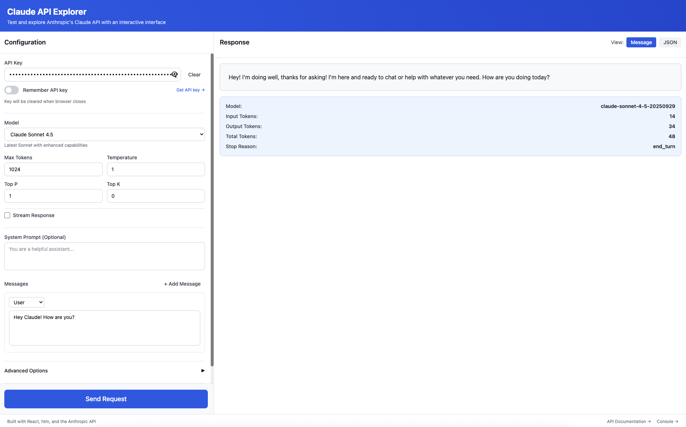

# Claude API Explorer

A visual, interactive web application for testing and exploring Anthropic's Claude API. Built with React, htm (no build step!), and Express.



## Features

### Core Functionality
- **Two-Panel Layout**: Configuration panel and Response display
- **Dynamic Model Selection**: Auto-fetches available models from API, shows full model IDs
- **Request Configuration**: Adjust parameters like max_tokens, temperature, top_p, top_k
- **Multi-Message Support**: Build conversations with multiple user/assistant message pairs
- **Conversation Mode**: Chat-style interface for multi-turn conversations with automatic context preservation
- **Multiple API Endpoints**: Messages, Message Batches, Models, Skills, Usage Reports, Cost Reports
- **Batch Results Viewer**: View JSONL batch results in-app with expandable cards, refresh status buttons
- **Skills API (Beta)**: List, create, get, and delete custom skills with folder drag & drop upload
- **Skills Version Management**: List and delete skill versions before deleting skills

### Streaming & Thinking
- **Streaming Responses**: Real-time SSE streaming with incremental text display and blinking cursor
- **Extended Thinking**: Manual budget control (1K-128K tokens) for complex reasoning
- **Adaptive Thinking**: Effort levels (low/medium/high/max) for automatic thinking depth — Opus 4.6
- **Structured Outputs**: JSON schema validation for constrained response formats
- **Thinking Display**: Collapsible thinking blocks shown before response content

### Advanced Features
- **Vision Support**: Upload images via file picker or add by URL, with thumbnail previews
- **Server-Side Tools**: Toggle Anthropic-managed tools (Web Search, Web Fetch, Code Execution, Computer Use, Text Editor)
- **Client-Side Tool System**:
  - Demo mode with mock data for offline testing
  - Real mode with actual API integrations (Weather, Web Search)
  - 5 developer tools: Enhanced Calculator, JSON Validator, Code Formatter, Token Counter, Regex Tester
  - Automatic tool execution when Claude requests tools
- **Request History**: Automatically saves last 50 requests with full request/response data, individual delete
- **Export**: Export history as JSON, Copy as cURL command
- **API Key Management**: Option to persist key or clear on browser close

### Response Display
- Toggle between formatted message view and raw JSON
- Token usage statistics (input/output/total)
- Model and stop reason metadata
- Error handling with inline display

## Tech Stack

- **React 19** with htm (Hyperscript Tagged Markup) - no build step required!
- **Tailwind CSS** via CDN
- **Express** proxy server for CORS handling
- **Vanilla JavaScript** ES6 modules
- **localStorage** for persistence
- **Jest 30** for unit testing

## Getting Started

### Prerequisites
- Node.js (any recent version)
- An Anthropic API key ([Get one here](https://console.anthropic.com/settings/keys))

### Installation

1. Clone or navigate to this directory

2. Install dependencies:
   ```bash
   npm install
   ```

3. Start the server:
   ```bash
   npm start
   ```

4. Open your browser and navigate to:
   ```
   http://localhost:3002
   ```

### First Use

1. Enter your Anthropic API key in the Configuration panel
2. Choose whether to remember the key (localStorage) or clear it on browser close (sessionStorage)
3. Select a model and configure parameters
4. Enter your prompt in the Messages section
5. Click "Send Request"
6. View the response in the Response panel

## Project Structure

```
claude-api-explorer/
├── index.html                    # Entry point
├── server.js                     # Express proxy server
├── jest.config.js                # Jest test configuration
├── package.json                  # Dependencies
├── README.md                     # This file
├── CLAUDE.md                     # AI development guide
├── .claude/                      # Claude Code configuration
│   ├── agents/                   # Custom review subagents
│   │   ├── api-docs-validator.md # Validates config against official Anthropic docs
│   │   ├── design-reviewer.md
│   │   ├── test-coverage-reviewer.md
│   │   └── code-reviewer.md
│   └── commands/                 # Slash commands
│       ├── explore.md
│       ├── design-review.md
│       └── sync-docs.md
└── src/
    ├── main.js                   # React root renderer
    ├── FullApp.js                # Main application (~2500 lines)
    ├── components/
    │   ├── common/               # Reusable UI components (Button, Toggle, Tabs, ErrorBoundary)
    │   └── responses/            # Response panel components (8 files)
    ├── context/
    │   └── AppContext.js         # Global state management
    ├── config/
    │   ├── models.js + .test.js
    │   ├── endpoints.js + .test.js
    │   └── toolConfig.js + .test.js
    └── utils/
        ├── localStorage.js
        ├── formatters.js + .test.js
        └── toolExecutors/        # Each with .test.js file
            ├── index.js          # Tool router
            ├── calculator.js
            ├── jsonValidator.js
            ├── regexTester.js
            ├── codeFormatter.js
            ├── tokenCounter.js
            ├── weather.js
            └── search.js
```

## Architecture

### No Build Step Required
This project uses `htm` (Hyperscript Tagged Markup) which provides JSX-like syntax that works at runtime without any build step. React is loaded from CDN via import maps.

### Express Proxy Server
Since browsers can't directly call the Anthropic API due to CORS restrictions, we use a simple Express proxy server that:
- Forwards requests to `api.anthropic.com`
- Adds proper CORS headers
- Runs on `localhost:3002`

### State Management
Uses React Context API for global state, with useMemo optimization to prevent unnecessary re-renders.

### Data-Driven Configuration
Models and parameters are defined in JS modules, making it easy to add new models without touching component code.

## How It Works

1. **User configures request** in the left panel
2. **Click "Send Request"** button
3. **Request goes to Express proxy** at `localhost:3002`
4. **Proxy forwards to Anthropic API** at `api.anthropic.com`
5. **Response displays** in the right panel
6. **Request saved to history** in localStorage

## Security Notes

- API keys are stored in browser storage (localStorage or sessionStorage based on user preference)
- **Never commit API keys to version control**
- **Don't use production API keys** in development/testing
- Clear your API key when using shared or public computers
- The proxy server only forwards to Anthropic's API - no logging or storage

## Browser Compatibility

Requires a modern browser with support for:
- ES6 Modules
- Import Maps
- Fetch API
- localStorage

Tested on:
- Chrome 89+
- Firefox 108+
- Safari 16.4+
- Edge 89+

## Features Implemented

✅ API Key management with persist option
✅ Dynamic model selector (fetches from /v1/models API, 9 models with dynamic max tokens)
✅ Parameter controls (temperature, top_p, top_k, max_tokens)
✅ System prompt
✅ Multi-message conversations
✅ **Conversation Mode** with chat-style UI and context preservation
✅ **Streaming responses** via SSE with incremental text display
✅ **Extended Thinking** with manual budget (1K-128K tokens)
✅ **Adaptive Thinking** with effort levels (Opus 4.6)
✅ **Structured Outputs** with JSON schema
✅ Vision API (image uploads with thumbnail previews)
✅ Multiple API endpoints (Messages, Batches, Models, Skills, Usage, Cost)
✅ Batch results viewer with expandable cards and refresh buttons
✅ Skills API tab (List, Create, Get, Delete) with folder drag & drop upload
✅ Skills version management (list/delete versions)
✅ Beta Headers toggle (7 current beta features)
✅ **Server-side tools** (Web Search, Web Fetch, Code Exec, Computer Use, Text Editor)
✅ Client-side tool system with demo/real modes
✅ 5 developer tools (calculator, JSON validator, code formatter, token counter, regex tester)
✅ 2 external API integrations (weather, web search)
✅ Automatic tool execution
✅ Request history (50 items, export, individual delete)
✅ **Copy as cURL** export
✅ Continue conversations from history
✅ Response view toggle (Formatted/JSON)
✅ Token usage statistics with thinking token display
✅ Dark theme UI with ErrorBoundary
✅ localStorage persistence
✅ Unit testing with Jest (178 tests, 72% coverage)

## Limitations

- Limited to 50 history items
- Usage/Cost APIs require Admin API key (sk-ant-admin...)
- History only for Messages endpoint
- Skills version deletion may not be fully supported in Anthropic's beta API
- Streaming does not yet support client-side tool execution mid-stream
- **Conversation Mode:**
  - Cannot edit past messages in chat interface (use MessageBuilder for edits)
  - No conversation branching or forking
  - Long conversations may hit context limits

## Future Enhancements

Potential improvements for the future:
- Streaming + tool execution combined (auto follow-up after tool_use in stream)
- Add keyboard shortcuts
- Add response comparison view
- Extract more components from FullApp.js (ConfigPanel, SkillsPanel, BatchesPanel, etc.)
- Migrate to TypeScript
- Expand test coverage to main app components (integration tests)
- Compaction support for long conversations (context_management API)

## Tool System

### Server-Side Tools (Anthropic-managed)
Toggle buttons add server-side tools to API requests. These run on Anthropic's infrastructure:
- **Web Search** - Real-time web search ($10/1K searches)
- **Web Fetch** - Fetch full page content (token cost only)
- **Code Execution** - Sandboxed bash + file manipulation
- **Computer Use** - Screen interaction (beta)
- **Text Editor** - File editing tool

### Client-Side Tool System
The application includes a hybrid tool execution system with two modes:

**Demo Mode (Default):**
- Uses mock data for all tool responses
- Works offline without any API keys

**Real Mode (No API Keys Required):**
- Enhanced Calculator: Full math expression support with functions
- JSON Validator: Validate and format JSON with analysis
- Code Formatter: Format JavaScript, Python, JSON
- Token Counter: Estimate Claude token counts
- Regex Tester: Test regex patterns with match details
- Weather: Real weather data from **Open-Meteo** (free, no signup)
- Web Search: Instant answers from **DuckDuckGo** (free, no signup)

## Troubleshooting

**"Failed to fetch" error:**
- Make sure the server is running (`npm start` on port 3002)
- Check that your API key is valid
- Check browser console for detailed errors

**Page doesn't load:**
- Clear browser cache and hard refresh (Cmd+Shift+R / Ctrl+Shift+R)
- Check browser console for errors
- Ensure you're using a modern browser with ES6 module support

**API errors:**
- Check your API key is correct
- Verify you have credits in your Anthropic account
- Check the error message in the Response panel for details

**Tool execution errors:**
- Currently in demo mode by default
- Enhanced calculator supports: sqrt, sin, cos, tan, pow, log, abs, min, max, etc.
- Use expressions like `sqrt(16)` or `sin(pi/2)` instead of operation-based format

## Development

To modify the application:

1. All components are in `src/FullApp.js` for simplicity
2. Edit and save - just refresh the browser (no build step!)
3. Common components are in `src/components/common/`
4. State management is in `src/context/AppContext.js`
5. Utilities are in `src/utils/`

### Testing

Run the test suite:

```bash
npm test              # Run all tests once
npm run test:watch   # Run in watch mode (re-runs on changes)
npm run test:coverage # Run with coverage report
```

**Test Coverage:**
- 178 tests across 10 files (72% coverage)
- Utilities: calculator, JSON validator, regex tester, code formatter, token counter, formatters, tool router
- Config: models, endpoints, tool configuration
- Colocated test files (e.g., `calculator.js` → `calculator.test.js`)

## Contributing

This is a personal project, but suggestions and improvements are welcome!

## License

MIT License - feel free to use this project for your own purposes.

## Links

- [Anthropic API Documentation](https://docs.anthropic.com)
- [Anthropic Console](https://console.anthropic.com)
- [Claude Models](https://docs.anthropic.com/claude/docs/models-overview)
- [htm Library](https://github.com/developit/htm)

## Acknowledgments

- Built with [React](https://react.dev)
- Styled with [Tailwind CSS](https://tailwindcss.com)
- Using [htm](https://github.com/developit/htm) for JSX-like syntax without build step
- Powered by [Anthropic's Claude API](https://www.anthropic.com)
- Inspired by [Square's API Explorer](https://developer.squareup.com/explorer/square)

---

**Note:** This is a development tool. For production use, consider adding authentication, rate limiting, and proper security measures.
